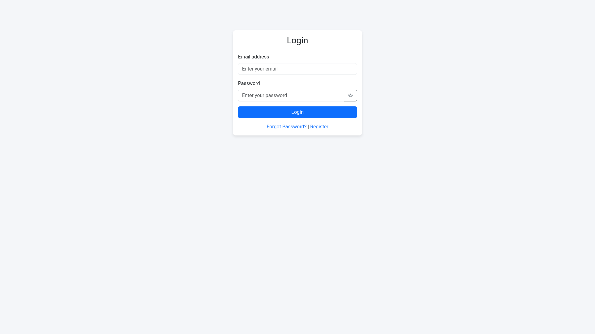
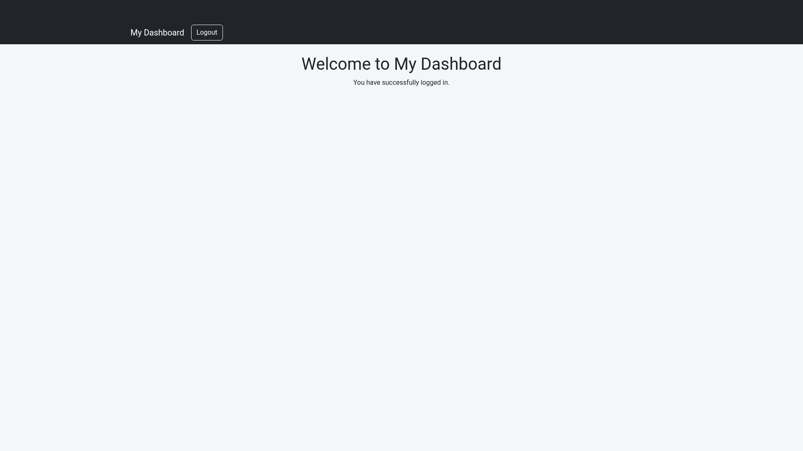
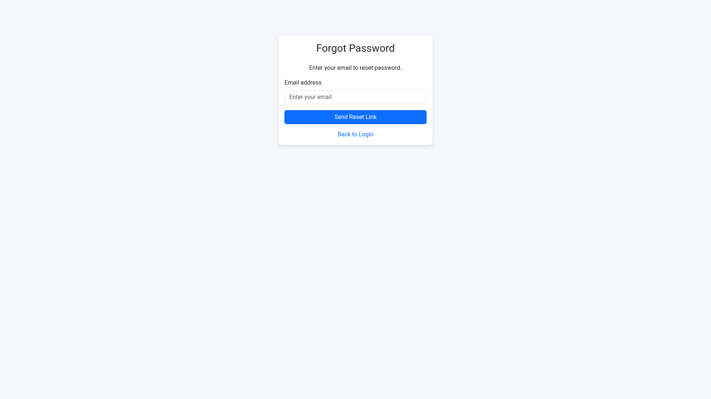
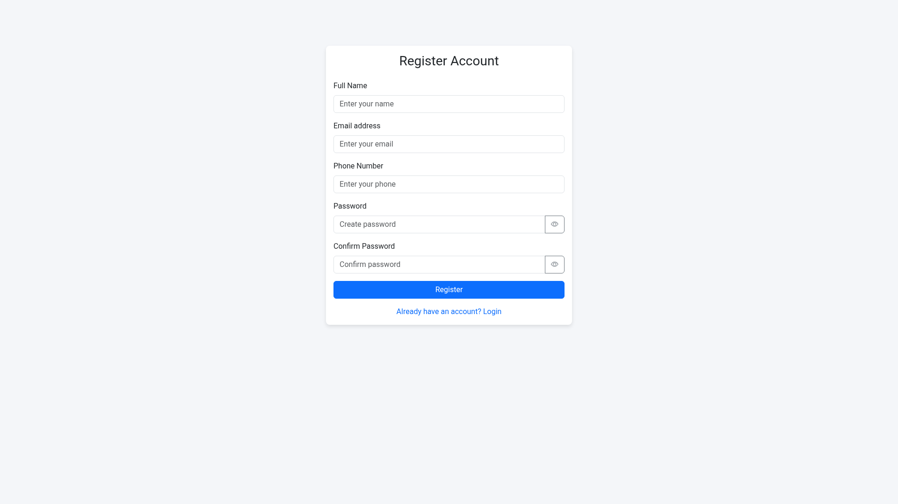
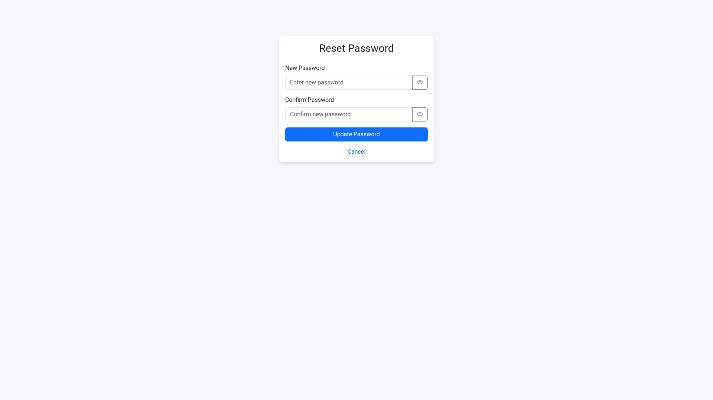

# HTML Authentication with Bootstrap 5

I have added bootstrap 5 to this project and made it responsive.  

## Features
- **5 Web Pages**: Login, Registration, Forgot Password, Reset Password, and Dashboard.
- **Bootstrap 5**: responsive design using Bootstrap 5.
- **Custom CSS Styling**: Added custom css using style.css
- **Responsive Design**: Tested and functioning well on desktops, laptops, tablets, and mobile devices
- **Google Fonts Icons**: for beautiful icons
- **Hosted on Github pages**- for live demo

## File Structure
- `index.html` - Login Page
- `register.html` - Registration Page
- `forgot-password.html` - Forgot Password  Page
- `reset-password.html` - Reset Password Page
- `dashboard.html` - User Dashboard Page
- `styles.css` - Custom styling rules
- `screenshots/` - Screenshots of all pages

## Images

### Login

### Dashboard

### Forgot-password

### Register

### Reset password

